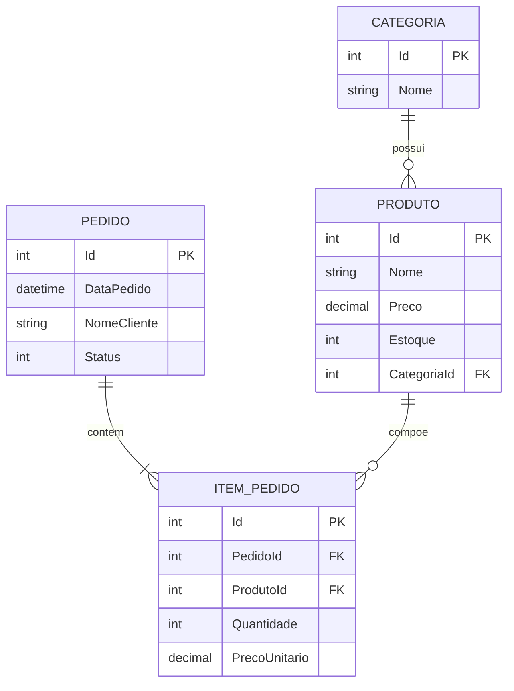

---

📚 Esse é um repositório para o projeto TechStore de 2026 promovido pelo Curso da PUCPR em parceria com a Volvo:

O projeto está sendo desenvolvido para cumprir os seguintes requisitos:
1. Tecnologias: .NET, C#, SQL Server e Entity Framework.
2. Arquitetura: API REST (Controllers, Verbos HTTP corretos, Status Codes adequados).
3. Modelagem de Dados: O arquivo README.md do repositório deve conter o
desenho/diagrama das tabelas do banco de dados.
4. Qualidade de Código: Uso de Boas Práticas (nomes significativos, organização em
pastas, Injeção de Dependência).
5. Swagger: A API deve estar documentada via Swagger para testes.

---

📫 Contato

Fique a vontade para entrar em contato conosco!

[Linkedin - Willian](https://www.linkedin.com/in/willian14551/) 
[Email - Willian](mailto:willian01314551@gmail.com?subject=Optional%20Projeto-TechStore-Volvo) 

[Linkedin - Felipe](https://www.linkedin.com/in/felipe-da-silva-mossato-0a335a223/) 
[Email - Felipe](mailto:felipemossato25@gmail.com?subject=Optional%20Projeto-TechStore-Volvo) 

---

⭐ Curso PUCPR-VOLVO 2026
