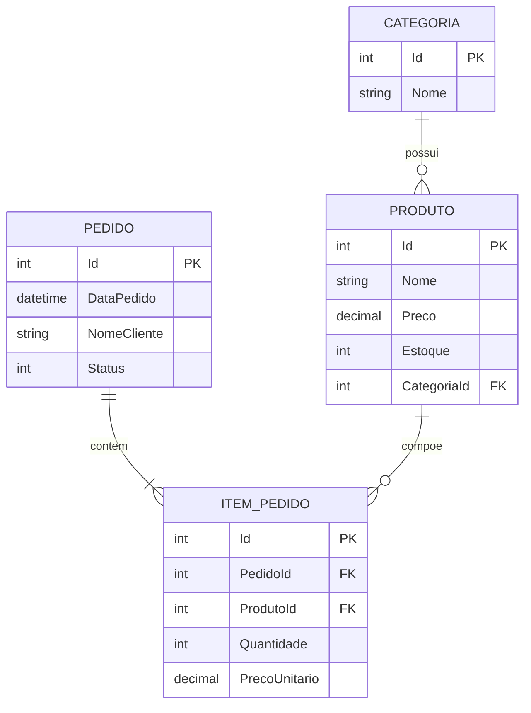

📚 Esse é um repositório para o projeto TechStore de 2026 promovido pelo Curso da PUCPR em parceria com a Volvo:<br>


O projeto foi desenvolvido utilizando as seguintes tecnologias:
1. Linguagem de programação: .NET 10 e C# 14, Microsoft SQL Server e .
2. ORM: Entity Framework - o projeto foi executado a abordagem Code First.
3. Banco de Dados: Microsoft SQL Server
5. APIs externas: Swagger/OpenAPI para a documentação da API.
6. Boas praticas no geral, como código limpo, nomes significativos de variáveis, organização separada em pastas.
7. Utilizamos o padrão de projeto organizacional MVC(Model View Controller).

---
<h2>Arquitetura do Projeto</h3>

# 1. Entity Framework
1. Foi utilizado como ponte entre o C# e o SQL server, proporcionando maior flexibilidade na hora de trabalharmos com o banco de dados.
2. Utilizamos migrations sempre que possível para que o código e o banco de dados estejam sempre com o estado mais próximo um do outro.
3. Foi também utilizado métodos assíncronos no geral e otimizações simples para melhor performance.

# 2. Arquitetura geral
1. Como dito acima, utilizamos de métodos assíncronos para melhor performance do projeto.
2. Utilizamos de DTOs para comunicação entre as classes no projeto, tanto para criação com os DTOs de entrada tanto para saída com os DTOs de resposta, garantindo melhor segurança dos dados enviados.
---

<h2>Como executar o projeto em sua máquina: </h2>
#Para a compilar o projeto em sua máquina é necessário ter instalado as seguintes ferramentas:
* **[.NET 10 SDK](https://dotnet.microsoft.com/download/dotnet/10.0)** (Verifique com `dotnet --version`)
* **[SQL Server](https://www.microsoft.com/pt-br/sql-server/sql-server-downloads)** (Express, Developer ou utilizando o Docker).

#Passo a Passo:


1. Clone o repositório:
   ```bash
    git clone https://github.com/willian14551/ProjetoTechStore-Volvo-2026.git
    cd ProjetoTechStore-Volvo-2026.git
    ```
2. Configuração da string de conexão:
Este passo é opcional, mas caso queira utilizar o docker é só alterar a string de DefaultConnection.

3. Instalação de dependências:
Após clonar o repositório, utilize este comando para instalar as dependências do projeto:
    ```bash
    dotnet restore
    ```
4. Aplicação das migrações
    Certifique-se de ter o Entity Framework instalado globalmente em sua máquina com o seguinte comando:
    ```bash
    dotnet tool install --global dotnet-ef
    ```
    Após isso, utilize este comando na pasta raiz do projeto(onde fica o arquivo . csproj) para instalar o banco de dados:
   ```bash
   dotnet ef database update
   ```
5. Compilação do projeto:
    Utilize-se do comando abaixo para a compilação:
   ```bash
   dotnet build
   ```
   e deste comando para executar o projeto:
   ```bash
   dotnet run
   ```
---
📫 Contato

Fique a vontade para entrar em contato conosco!

[Linkedin - Willian](https://www.linkedin.com/in/willian14551/)<br>
[Email - Willian](mailto:willian01314551@gmail.com?subject=Optional%20Projeto-TechStore-Volvo)<br>

[Linkedin - Felipe](https://www.linkedin.com/in/felipe-da-silva-mossato-0a335a223/)<br>
[Email - Felipe](mailto:felipemossato25@gmail.com?subject=Optional%20Projeto-TechStore-Volvo)<br>

--- 
Diagrama de entidade relacionamento do projeto:



⭐ Curso PUCPR-VOLVO 2026
